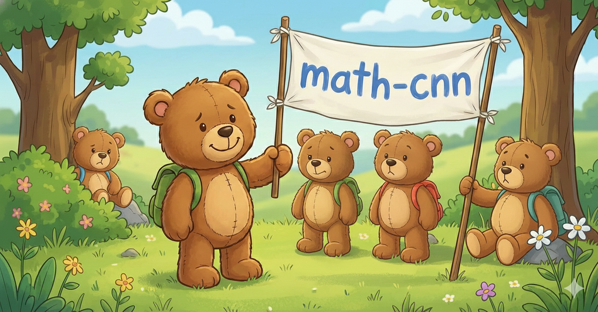

# math-cnn

Math-CNN is a small project where I build 2 things in total:
* A (quite) simple orchestration of neural networks whose purpose is to accurately identify handwritten mathematical expressions. It's based on and similar to the approach described in [ICDAR 2023 CROMHE](https://hal.science/hal-04264727/file/CROHME_2023_competition_report_paper.pdf) paper. 

* Math-CNN's application that further deduces the expression into a singular result using [SymPy](https://www.sympy.org/en/index.html). It's a popular Python library for tasks related/depended to/on symbolic mathematics.